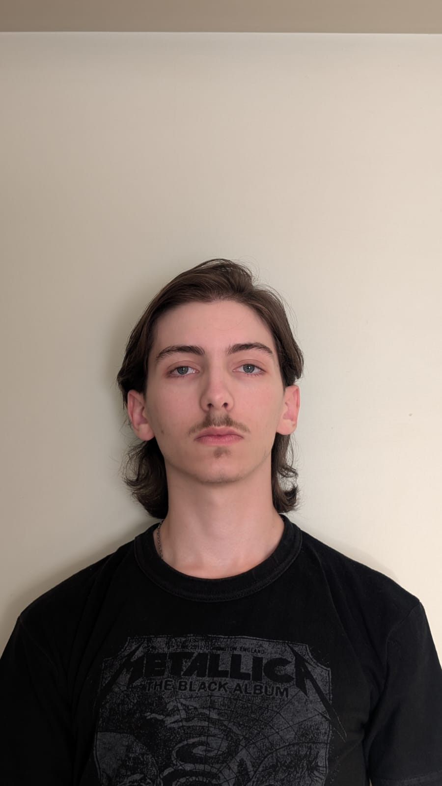
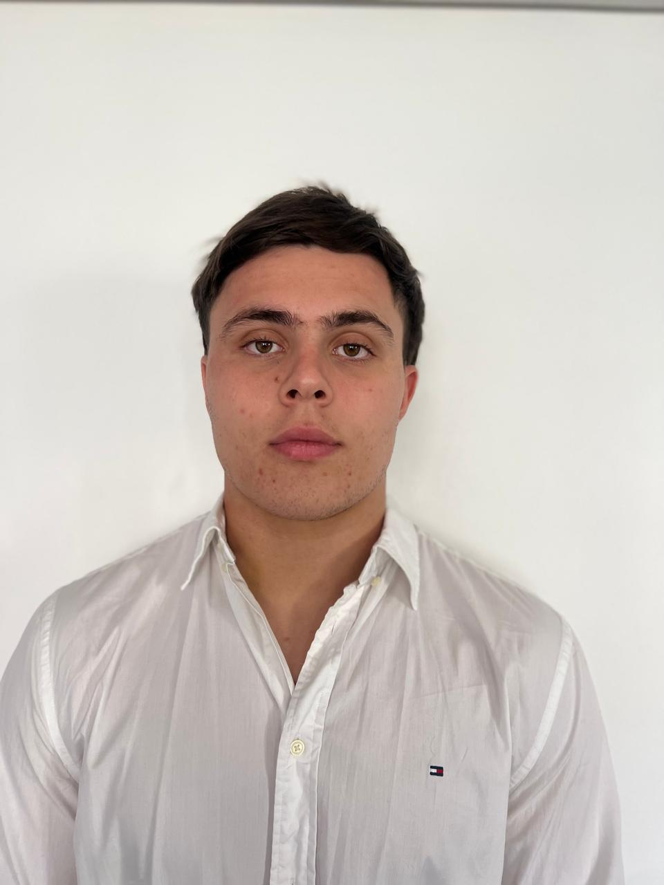

 

 
 

# 🚀 Proyecto de Programación 2

Este repositorio contiene las actividades y proyectos desarrollados por el grupo **"Los Compiladores"** para la materia Programación 2 de la Universidad Argentina de la Empresa (UADE).

## 👥 Integrantes del Grupo

Presentamos a los miembros de "Los Compiladores". *Haz clic en las imágenes para ir a sus perfiles de GitHub.*

 

|  |  |  |
| :---: | :---: | :---: |
| **Adrian Maldonado** | **Santiago Coco** | **Lucas Felice** |
| Legajo: 1220625 | Legajo: 1220810 | Legajo: 1141923 |
|  |  |  |

 

|  |  |  |
| :---: | :---: | :---: |
| **Fadi Abdala** | **Tomas Lerman** | **Theo Lambert** |
| Legajo: 1222122 | Legajo: 1215616 | Legajo: 1156352 |
|  |  |  |

 

## 📂 Estructura del Repositorio

A continuación, la organización de las actividades entregadas:

* **`/Actividad1_Introduccion`**: Primeros pasos y estructuras básicas.

## 🛠️ Tecnologías Utilizadas

***

Desarrollado por los compiladores - 2026

